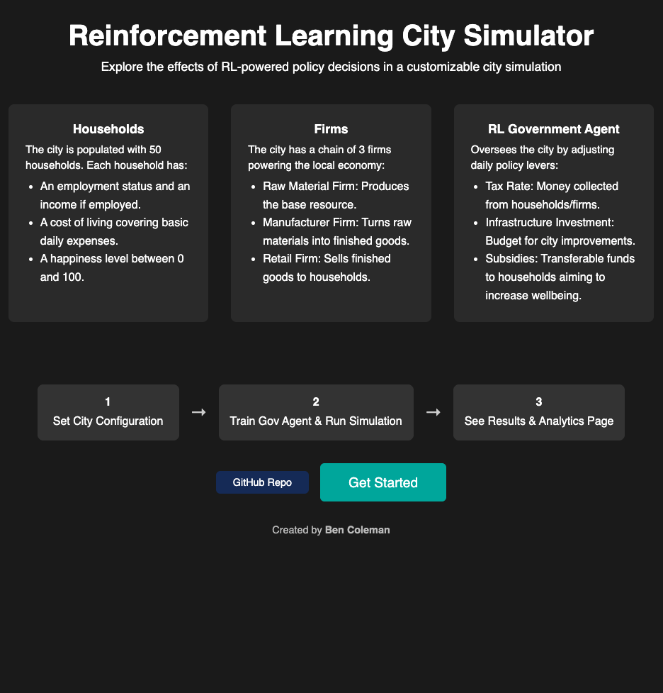
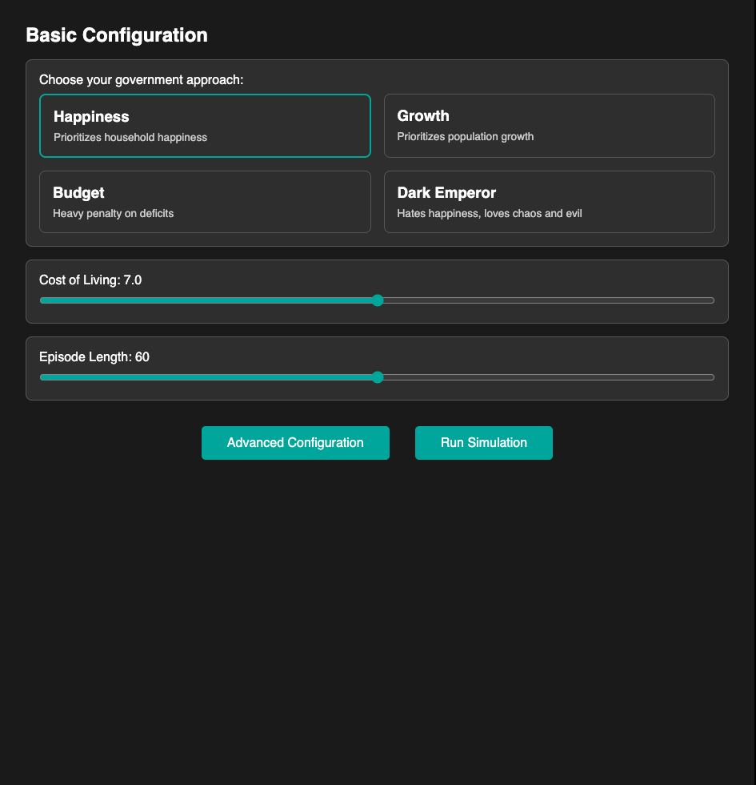
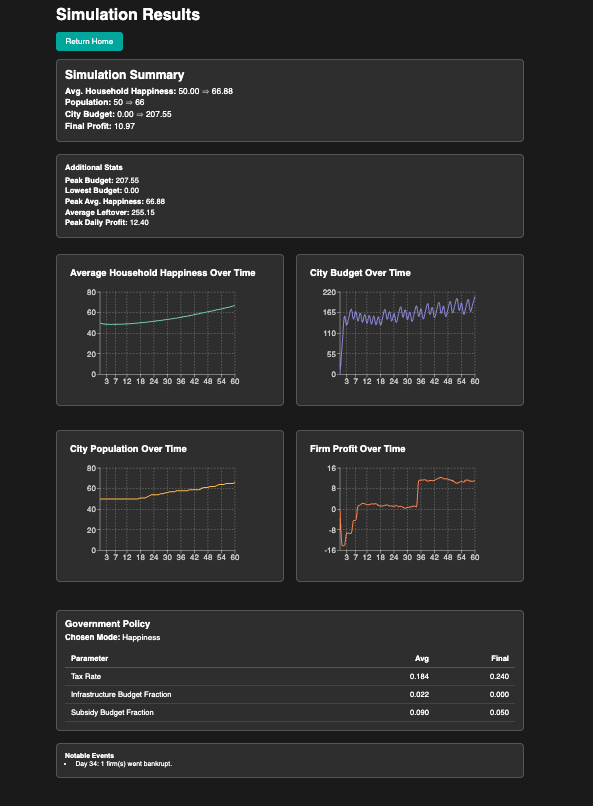

# Reinforcement Learning City Simulator

This is a Reinforcement Learning-based City Simulator, where a Government RL Agent manages tax rates, infrastructure spending, and subsidies to influence city economics and happiness. On the website, you can configure various parameters, run the simulation, and view the simulation results which include various visualisations and statistics. 

## Try out the website -> https://www.rlcitysim.com

## City Overview

This project explores how an RL agent can impact city-wide metrics (like household happiness, budget, profit, and population) by choosing daily policy levers. The environment includes:

 **Households** 

The city is populated with 50 households. Each household has:

- An employment status and an income if employed.
- A cost of living covering basic daily expenses.
- A happiness level between 0 and 100.

**Firms** 

The city has a chain of 3 firms powering the local economy:

- Raw Material Firm: Produces the base resource.
- Manufacturer Firm: Turns raw materials into finished goods.
- Retail Firm: Sells finished goods to households.

**RL Government Agent**

Oversees the city by adjusting daily policy levers:

- Tax Rate: Money collected from households/firms.
- Infrastructure Investment: Budget for city improvements.
- Subsidies: Transferable funds to households aiming to increase wellbeing.

**See [City Simulation Docs](docs/CitySimulation_Overview.md) for an in-depth explanation of the city simulation environment.**

## Project Features 

**Configurable Government Modes**: Choose what you would like your government to prioritize. Choose between a Happiness-focused, Growth-focused, Strict Budget, “Dark Emperor,” or make your own custom RL reward function.  
- **Customize your City Environment**:
  Basic or Advanced configuration to tweak:
  - Cost of living
  - Shock probability (random production shocks)
  - Inflation
  - Wage range, etc.

- **Results & Analytics**: After the simulation is finished running, the website presents a dashboard which displays:
- 4 line charts (Happiness, Profit, Population, Budget)
- Final and peak statistics (budget, spending, happiness, etc.)
- Details on the final government policy (tax rate, infra fraction, etc.)

## How Everything Works

1. **Frontend** (React)
    - Landing/Home Page
    - Configuration Pages (Basic/Advanced)
    - Loading Page - calls the backend
    - Results page showing charts/stats

2. **Backend** (Flask in Python)
   - Receives configuration and trains a PPO agent (via Stable Baselines3).  
   - Runs a final deterministic simulation with the trained policy.  
   - Returns time-series data and final stats as JSON.

3. **Environment** (Gym-Style)  
   - See [docs/CitySimulation.md](./docs/CitySimulation_Overview.md) for a full breakdown of Household logic, Firms, Government policies, reward modes, and daily step mechanics.

**Website hosted on [Render](https://render.com).**  
---

## **Enjoy exploring the RL City Simulator!** Contributions and feedback are welcome. 
Feel free to reach out - **bencoleman08@gmail.com**

## Screenshots

Here are some example screenshots of the website pages:

### 1. Landing / Intro Page

### 2. Basic Configuration Page

### 3. Results Page (Zoomed out)

